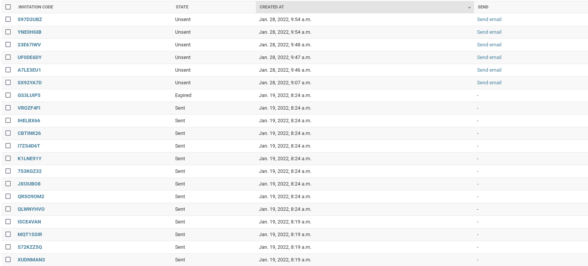
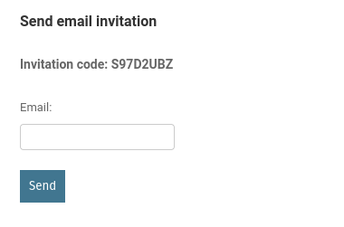
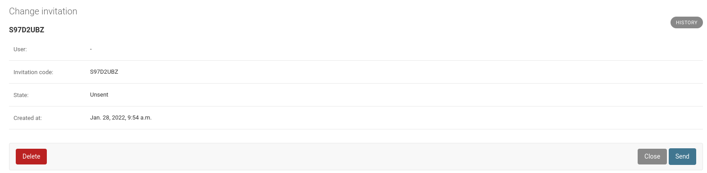

# Manually integrating with any registration provider.

At its core, Getin is a simple model. We provide all the helpers you'll need
for working with this model.

The workflow for any invitation is as follows:

1. Create an invitation.
2. Send the invitation.
3. Consume the invitation.

## Creating invitations.

Use our high level interface for creating objects:

```python
from getin.models import Invitation

invitation = Invitation.create()
```

Instead of manually creating objects, you need to use our special `create`
class method unless you want to do something specific.

## Sending invitations

You can send invitations however you want but we provide simple helpers to
allow you to email an invitation to someone.

### Sending via the admin

After having created an invitation, you'll be able to send it right from
the admin.



Only invitations that are **Unsent** can be sent.

Click on send email from the change list and you'll be greeted with the
following screen:



Enter the recipient's email address and click *Send*. The invitation will
now be marked as **Sent**.

You'll also find a *Send* button in an Invitation's detail view:



### Sending via the CLI

You can also email an invitation using our CLI:

```shell
python manage.py getin --id 1 --send --email john@smith.com
```

Replace the `--id` flag with the *id* of the invitation you're trying to send.

### Sending your own way

You can send an invitation any way you want but Invitations have to be
marked as *Sent* in order for a user to consume them.

If for example, you sent an invitation via SMS or Slack, you need to manually
mark the Invitation as *Sent*.

To do that, we provide an admin action:

1. From the changelist, select any invitation you want to mark as sent.
2. From the *Action* menu at the top, select *Mark selected invitations as sent*.
3. Click *Go*.

Your invitations will now be marked as sent and are ready to be consumed.

## Consuming invitations

Invitations are consumed by Users upon successful signup.

You'll have to get hold of the invitation and call the `consume` method:

```python
from getin.models import Invitation
from django.contrib.auth import get_user_model

User = get_user_model()

invitation = Invitation.objects.get(code="MyCode")
user = User.objects.get(pk=1)
invitation.consume(user)
invitation.save()
```

Once an invitation has been consumed, it can no longer be used.

In general, you'll consume invitations after a user has successfully signed up
by setting this logic in the *success view* itself or by setting up a signal.

Note that you need to call `save` on the instance for it to actually save to
the database. The `consume` method only takes care of logic and setting the
state in memory.
